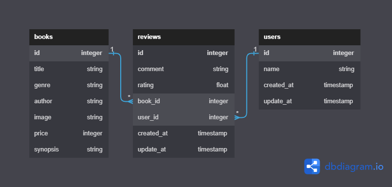

# Phase-3-Active-Record-Code-Challenge-Product-Review

## Introduction

The `aseBookstore` project is an online bookstore fullstack web application that hosts a variety of books for and ensures easy management of books catalog in the system for the readers.

The `Home` page of the application renders all the available books in the database in a grid format for easy access to individual books.
The `aseBookstore` web application also allows the user to add, edit and delete books in the database.

The project includes three models: User, Review, and Book. The relationships between these models are defined as follows:

- A `Book` has many `Review`
- A `User` has many `Review`
- A `Review` belongs to both a `User` and a `Book`

## Entity Relationship Diagram (ERD)

## Project Setup

The project is hosted on two separate repositories:

- The [React Frontend](https://github.com/Ase020/ase-bookstore-crud-app) deployed at the [aseBookstore](https://ase-bookstore-crud-app.vercel.app)
- The [Ruby Backend](https://github.com/Ase020/phase-3-sinatra-react-project)

To set up the project, follow these steps:

- Navigate to the `Ruby Backend` repository to start the server.
- In the `Ruby Backend` folder, open the terminal and run `bundle install` to install the necessary dependencies for the project.
- Run `bundle exec rake db:seed` to populate the database tables with data already in the `seeds.rb`file.
- To start the backend server, run `bundle exec rake server`, if successful, the server should start running on your `localhost` port number: `9292`

- Visit [aseBookstore](https://ase-bookstore-crud-app.vercel.app) on browser and manage your books on our interactive app.

## Acknowledgements

This project was developed as Sinatra-ActiveRecode project assignment. Special thanks to my technical mentor Solomon Kitonyi for his guidance and support.

## Author

Felix Nyalenda - Software Engineer
